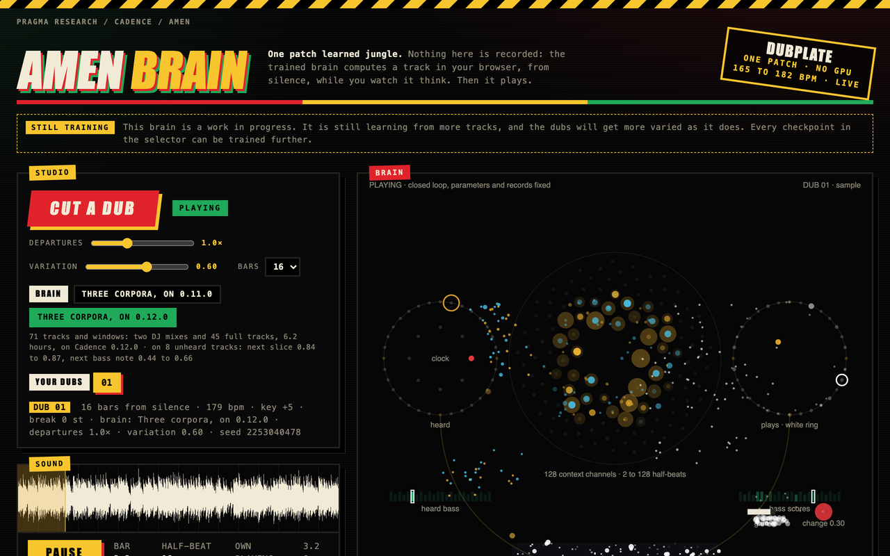

# Amen

A jungle composer in one patch, running in the browser. One Cadence record
patch learned jungle tracks as events per half-beat: a slice of a drum break, a
sub-bass note, a change flag and a texture. Nothing on the page is recorded.
Press the button and the brain starts from silence, hears a count-in and
computes a track one half-beat at a time, hearing each half-beat it plays. The
page then renders the track through its instrument and plays it, with every
note and the brain's activity in time with the sound.

[](https://floatingpragma.io/demos/amen/)

## What it demonstrates

- **Composing from silence.** The brain makes a track of its own, one half-beat
  at a time, in the browser tab. There is no server and no recorded audio
  beyond the instrument's samples.
- **A loop through the world.** The brain hears each half-beat it played, so
  what it does next depends on what it did.
- **Slow and fast memory in one patch.** 29,895 slow parameters carry what the
  corpus sounds like. 8,192 record cells carry particular moments, written in
  one shot. On tracks it never heard the brain names the next bass note 52% of
  the time with its records writing as it listens, and 3% without records.
- **Parameter steps that have to prove themselves.** A learning step is kept
  only when a replay without targets predicts the same half-beats better than
  before. Otherwise the step is halved and tried again.
- **Trained on a laptop.** The whole training, nine epochs on up to 6.2 hours
  of music, took 78 CPU minutes on one core, with no GPU.
- **Training that repeats exactly.** The brain was trained from random
  parameters on Cadence 0.70.0. On the same machine the recipe gives the same
  brain byte for byte: its files are identical to those of the brain trained on
  Cadence 0.11.0 that this page carried before.
- **Prediction on tracks it never heard.** Eight tracks were held out, and the
  scores stand beside baselines on the same rows.
- **An engine you can check.** The page runs a JavaScript version of the
  patch's forward pass. It reproduces the Python library's run from silence in
  every slice, note and change point.
- **Listening decides.** One epoch before the final, the same brain scored as
  well on held-out tracks and played almost nothing from silence. A brain goes
  on the page after its dubs have been listened to.

## How it is built

The brain is one `RecordPatchNet` of Cadence 0.70.0:

```python
import numpy as np
from cadence import RecordPatchNet

net = RecordPatchNet(80, 128, 71, seed=1103, cells=8192, active=48, record_rate=0.5)
```

It learns one track at a time, 32 half-beats per call. The input at each
half-beat is a clock and the event heard one half-beat earlier; the target is
the event of this half-beat:

```python
net.reset()                                        # a new track: clear the context, keep what was learned
for start in range(0, len(events), 32):
    net.observe(inputs[None, start:start + 32], events[None, start:start + 32],
                rate=256.0, backtrack=True)
```

`observe` predicts the 32 half-beats with the records as they stood. It then
moves the slow parameters along the adjoint gradient of the slow readout's
error over those half-beats, and keeps the step only if a replay without
targets lowers that error. Last, it writes what the slow readout still got
wrong at each half-beat into that reading's record cells.

Playing is one call per half-beat, with the brain's own played event as the
next input:

```python
net.reset()
heard = count_in
for t in range(128):                               # sixteen bars
    x = np.zeros((1, 1, 80))
    x[0, 0, 0] = float(t == 0)                     # the wake
    x[0, 0, 1 + t % 8] = 1.0                       # the eight-position clock
    x[0, 0, 9:] = heard                            # the event it played last
    scores = net.advance(x).output[0, 0]
    heard = play(scores)                           # one slice, one note, a change flag, the texture
```

The page does not run Python. [web/engine.js](web/engine.js) is the same
forward pass and playing rule in JavaScript: a gated linear context, a k-winner
record code over a fixed random projection regenerated from the seed, and a
record read added to a linear readout. [parity.mjs](parity.mjs) checks it
against the library's own run.

The rest is the page. [web/index.html](web/index.html) holds the studio, the
instrument, the drawing of the brain and the rules that make two dubs differ.
`web/models/three-corpora/` holds the trained brain: the slow parameters as
float64, the record table as float32, the running mean of the record reading
and `model.json` with every constant. `web/kit/` is the instrument: 32
half-beat slices of a drum break and twelve sub-bass notes. `runs/r070-s2e9/`
holds the brain's receipt and the archived run from silence that the browser
engine must reproduce. [verify.py](verify.py) rechecks all of it.

The trainer, the transcription of recordings into events and the training
material are kept outside this repository. The receipt names the sealed
training runs by hash.

## Brain layout

Amen runs on `RecordPatchNet`, one of the advanced engines that **Cadence
0.70.0** keeps beside its main `Brain.compose` interface.

| Part | Size | Role |
| --- | --- | --- |
| Input ports | 80 | A wake, an eight-position clock and the 71 ports of the event played last |
| Context channels | 128 | Gated channels that each keep a running trace of the input, with time constants from 2 to 128 half-beats at birth |
| Record cells | 8,192, of which 48 fire per reading | What the slow readout got wrong at particular readings, keyed by the event heard and the context |
| Output ports | 71 | 32 drum slices, drum presence and gain, 24 bass semitones, bass presence and sustain, a change flag, 10 texture bands |
| Slow parameters | 29,895 | The gates, the input port and the linear readout |

A record patch is one temporal patch. Its context is a gated linear path that
satisfies its own equations at every half-beat, the nonlinearity sits at the
ports, and the record store is its memory of particular moments. The output is
the linear readout of the context plus the record read. On the page the brain
keeps its trained records and does not write new ones while it plays.

This is not the System 1 brain of `Brain.compose`, and it has no observers.
`Brain.compose` builds a continuing brain that chooses actions and learns from
reward; a record patch learns to predict the next event of a stream. See the
[record patch guide](https://github.com/muellerberndt/cadence/blob/v0.70.0/docs/record-patch.md)
and the [brain guide](https://github.com/muellerberndt/cadence/blob/v0.70.0/docs/brain.md).

## Run

The page is static. It needs no install and no build step:

```sh
cd cadence-demos
python3 -m http.server -d amen/web 8803
```

Open **http://localhost:8803** and press **Cut a dub**. The Departures slider
scales how often the brain leaves the loop at a predicted change point. The
Variation slider sets how much one dub differs from the next. The seed is
printed under the button; the same seed and settings give the same dub.

To check the receipt, the model files and the browser engine:

```sh
python3 amen/verify.py      # the receipt's sources and the model files; runs the parity test when node is installed
node amen/parity.mjs        # the browser engine against the archived run
```

[floatingpragma.io/demos/amen](https://floatingpragma.io/demos/amen/) serves a
pinned copy of `web/` with the same model files.

## What the brain receives

The training material is two DJ mixes and 45 full tracks, 6.2 hours in 71
tracks and windows. A transcription turns each recording into one event per
half-beat: the break's position, the sub-bass semitone, a change point where a
half-beat departs from the same position one bar earlier, and the sustain above
250 Hz with the played slice's own tail removed. The brain sees those events
and nothing else. At each half-beat its input is the clock and the previous
event, and it is taught the current one.

Supplied by hand: the transcription, the instrument, the clock, the count-in
and the three moves a departure may make. A roll repeats the slice just heard,
a retrigger restarts the break at a bar start, and a bar jump plays the same
position in another bar of the break. Learned from random parameters and empty
records: every event the brain plays, the gains, the bass line, when a change
point is due and the texture.

Cadence is an observer-like self-reading system. Here the patch has bounded
local state (its context channels), ports (the clock, the heard event and the
output scores), readback (it hears the event it played), records (its record
cells) and a repair move (the checked parameter step and the record write).
The receipt beside the page is its public evidence.

## Why two dubs differ

From silence, the highest score at every port gives one and the same track.
Each dub therefore draws the following from its seed, scaled by the Variation
slider. At zero none of it is drawn.

- **The bass** of the first two bars, and of every departure, is drawn from the
  brain's own scores over notes.
- **A drum pattern of the dub's own.** The break enters on one of its four
  bars. Over the first one, two or four bars departures are drawn at a raised
  probability. That opening is the dub's loop: its slices return at the same
  place in every cycle unless the brain draws a fresh departure there. Between
  those places the brain plays on from what it hears.
- **Instrument settings.** A tempo between 165 and 182 bpm, the break's pitch,
  a key, the pad's waveform, chord and register, how the pad is played, and a
  filter sweep.

These are rules of the page, not of the brain. The transcription reads every
repeating bar as the break in order, so a track's own chop is not in the
training data.

## Measurement and evidence

The brain was trained as nine sealed one-epoch runs, each continuing the one
before: six epochs on the two mixes (26 tracks and windows), then three epochs
on all 71. That is 596,232 half-beats presented in 18,753 chunks, and every
chunk's step was admitted. The nine runs took 4,692 CPU seconds on one core of
an Apple M4 laptop, including each run's own evaluation and renders, with
Python 3.13, NumPy 2.5.3 and Cadence 0.70.0 at commit `be854bd`.
[runs/r070-s2e9/receipt.json](runs/r070-s2e9/receipt.json) lists the nine runs
with their receipt hashes and names the independent verification of the last
one.

Next-event accuracy on the eight held-out tracks, with the records writing as
the brain listens, beside baselines on the same rows:

| Measure | The brain | Baseline |
| --- | --- | --- |
| Next drum slice | 0.85 to 0.88 | 0.03 to 0.05, the most frequent slice |
| Next bass note | 0.41 to 0.64 | 0.13 to 0.52, repeating the previous note |
| Texture bands, mean error | 0.080 to 0.134 | 0.099 to 0.173, repeating the previous half-beat |
| Change points recalled | 0.08 to 0.22 | |
| Next drum slice without records | 0.79 to 0.85 | |
| Next bass note without records | 0.02 to 0.06 | |

What the runs show:

- **The browser engine matches the library.** On the archived run from silence
  it reproduces all 128 slices, bass notes and change points, with output
  scores equal to 3e-8 (the record table ships as float32). It also reproduces
  the library's record writes: after observing its own first four bars, the
  continuation matches to 3e-8.
- **The same brain as before, from scratch.** The first brain on this page was
  trained in September on Cadence 0.11.0. Training again from random parameters
  on 0.70.0, on the same machine with the same recipe, gave the same slow
  parameters and records byte for byte. The model files did not change when the
  page moved to 0.70.0. On a different processor and numerical library the
  recipe gives a close twin with the same behaviour, not the same bytes.
- **A track costs little.** In Node the engine builds the brain in about 35 ms
  and composes sixteen bars in about 0.3 s on the same laptop. One half-beat
  takes about 1 ms in the Python library on one x86 core.

What they do not show:

- **A stable path through training.** After the eighth epoch the brain played
  10 drum hits and one bass note in sixteen bars from silence, with held-out
  scores as good as the final brain's. The ninth epoch restored full playing.
  The export tool refuses a brain whose run from silence plays drums on fewer
  than half of the half-beats or bass on fewer than a quarter, and a brain goes
  on the page only after its dubs have been listened to.
- **More variety from more music.** Three times the material raised the number
  of bass notes per dub and did not make two dubs differ more. The page's
  variation comes from the rules above.
- **A comparison with other learners.** There is no transformer or recurrent
  baseline on the same stream, and one training seed.
- **Free placement of departures.** Change points are hard to predict, and the
  brain has no phrase clock. It places departures by what it just heard, not by
  where a sixteen-bar phrase ends.

The break is one break, so the drum vocabulary is its 32 slices. The texture is
smoother than a recorded one, because a squared-error readout predicts the
mean. The training material is from the owner's library and is not part of
this repository. The instrument's drum slices come from a sampled drum break
and its bass notes from a sample pack; whether they may be redistributed has
not been verified, and the kit is a separate folder so it can be replaced
without touching the brain.
