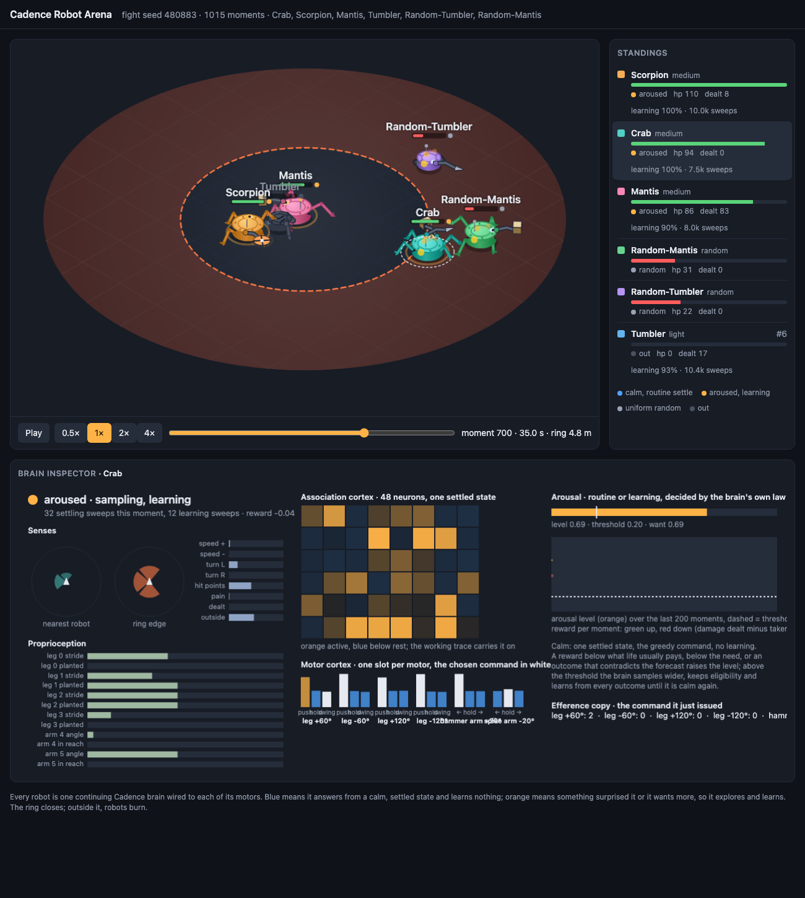
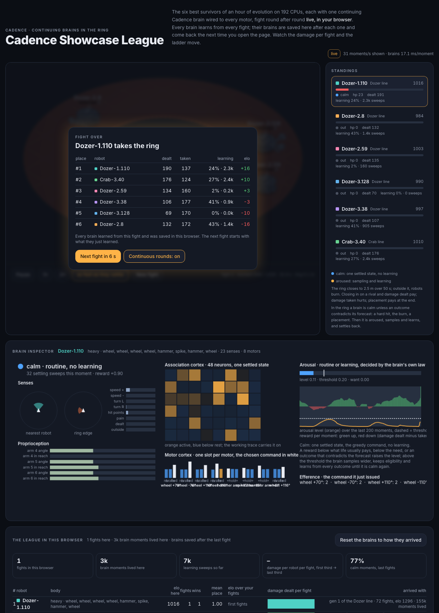
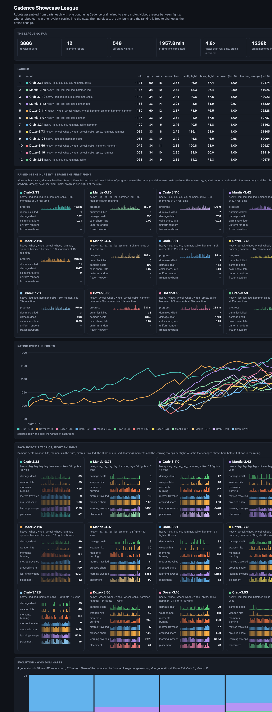
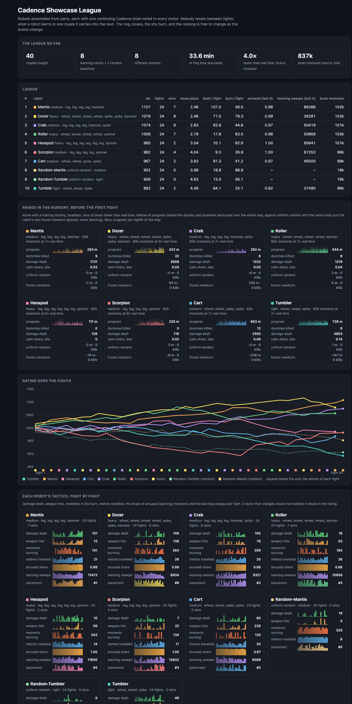

# Cadence Robot Arena · the Cadence Showcase League

> This folder is the arena as a Cadence demo: the code, the page, the 0.79 leagues
> (`league-079`, `league-evolved-079`, the page's roster in `league-live`) and the measurements.
> The arena's own repository, [cadence-robot-arena](https://github.com/muellerberndt/cadence-robot-arena),
> carries the full history, including the 0.77 leagues the docs refer to, and the replay pages.

Assemble a robot from parts, give it a [Cadence](https://github.com/muellerberndt/cadence)
brain wired to every motor, raise it in an accelerated nursery, and send it into ranked
battle royales. Each robot has one life: the brain that learns to walk is the brain that
fights, and it keeps learning from every fight it wins or loses.



## Live in the browser: the Showcase League page

[`showcase-app/`](showcase-app/) is the league as a web page: the six best robots of the
evolved league fight and learn live in a web worker (Pyodide runs the released Cadence
wheel and this repository's own `arena` code), every brain is saved in the browser after
each fight and restored on the next visit, and a click on a robot opens its brain
inspector. Vite + React + TypeScript + Tailwind, no backend; `showcase-app/README.md` has
the run, check and Lovable deployment steps, `scripts/package_showcase.sh` builds the
upload zip, and `showcase-app/check_page.mjs` is the scripted check of the page's promise
run before every deploy. What the page can and cannot show is measured in
[STATUS.md](STATUS.md#the-ring-measured-2026-10-08-evening): the brains learn
and change in the ring, and their tactics are weak; the ring stage (`--stage` on `royale`,
the `stage` of the pack) keeps them calm unless surprised.

## What a robot is

A **blueprint** is a chassis (light, medium or heavy: footprint, mass, hit points, mount
points) with parts bolted to its rim:

| part | motor | what it does |
| --- | --- | --- |
| `wheel` | reverse / brake / forward | pushes along the heading at its mount point; wheels on one side turn the robot |
| `leg` | push forward / hold / push back | a planted foot drives the body until its stride is spent, then a stepping reflex lifts it, swings it to the other end and plants it again; legs in step lurch, legs out of phase walk, legs on one side turn |
| `arm` + `spike` | swing left / hold / swing right | hurts a chassis it touches, more the faster it closes |
| `arm` + `hammer` | the same | hurts on a swinging blow, then needs 0.8 s |
| `arm` + `spinner` | the same, plus on / off | spins up over two seconds, hurts by its spin, kicks both robots back |

Masses add up; a heavier robot accelerates slower and rams harder. Ramming hurts both,
the lighter more. The eight stock robots (`arena/parts.py:stock_designs`) cover wheels and
legs, two to six limbs and every weapon; `python -m arena design` assembles your own.

## What the brain is

One composed graph per robot (Cadence's `Brain.compose` layout): the
senses drive a processing region, the association region exchanges signals with the motor
cortex, and the working trace feeds the association region its own recent state. The motor
cortex is grouped into **one slot per motor** (`Blueprint.slots`): the settled state of the
whole graph is read as one command per motor, so every motor is driven by the same
equilibrium. There is no gait generator, controller or policy head between the brain and
the body.

`requirements.txt` pins [Cadence 0.79.0](https://pypi.org/project/cadence-net/0.79.0/),
which includes the income, exploration and action-credit repairs used by this arena.
The nursery's outcome-custody checks require this release's repaired income counter.

The senses (`arena/senses.py`) are the kind an animal has: four broadly tuned direction
cells for the nearest other robot (ahead, left, behind, right, by proximity), the same four
for the edge of the ring, speed and turning, hit points, pain, damage dealt, and the
proprioception of every leg (stride, foot planted) and arm (joint angle, a chassis within
the weapon's reach, spin).

The robot lives through `Brain.live`. Calm, it answers from one settled state and learns
nothing. A reward below what its life usually pays, below its need, or an outcome that
contradicts its forecast rouses it: it samples its commands more widely, learns from every
outcome through TD eligibility and writes memory, until it is calm again. Every constant
of this law and of the learner is a gene of the blueprint (`arena/brain.py:FOUNDER`). The
founder values were selected in this repository's nursery grids ([STATUS.md](STATUS.md)):
the library's reward-chamber point left every robot observation-blind here, because its
efference copy drowned the senses and its actor step saturated the motor cortex before the
senses' signal could accumulate. The founder has no efference copy, a sensory projection at
four times the composed scale, an actor step of 0.03, eligibility decay 0.6 and a learner
temperature of 0.5. The chamber point (`preset: chamber`) and the library's composed
defaults (`preset: compose`) are the controls, one gene away.

## The nursery

`python -m arena nursery` puts each newborn alone in the ring with a training dummy that
never moves and never strikes back. The world pays metres of progress toward the dummy,
damage dealt, and one unit for destroying it; damage taken (ramming hurts, and the strip
along the wall burns) is suffering. The dummy reappears elsewhere when destroyed or after
400 moments, so approaching is a repeated problem. The pupil cannot die in the nursery:
every pain is paid, its hit points are restored each moment. The nursery runs headless as
fast as the brain settles, tens of times faster than the body's twenty moments per second,
with one process per robot. The checkpoint it writes is the brain that fights.

The nursery's final reward stays owed to its last executed command. The league saves
that exact reward beside the brain and delivers it once with the first observation of
the next nursery or fight, marked as a terminal boundary because the physical world
starts again. The brain itself is never reset. Direct callers of `run_nursery` must save
the report's `owed` with the checkpoint and supply it when continuing. Repeated nursery
runs keep the pupil's acquired brain; the frozen control is always a fresh brain of the
same body and founder seed.

Readings per block of moments: progress, dummies destroyed, damage, the share of aroused
moments, sweeps and milliseconds per moment. `--controls` runs the uniform-random policy
with the same body (the baseline) and a frozen newborn (greedy, never learning).

## The royale

`python -m arena royale` puts up to six robots in a ten-metre ring that closes to 2.5 m
over fifty seconds; outside the ring, robots burn. Each robot's reward per moment is the
damage it dealt minus the damage it took, in units of twenty hit points, plus the metres it
closed on its nearest rival (the nursery's appetite, at a third of its weight). The fight's end is
a declared boundary of its continuing life, paid by placement (+1 for the winner down to
-1 for the first out) and delivered with the first observation of its next fight. Brains
settle in parallel, one worker per robot. Elo is updated pairwise by placement; every fight
is recorded as a replay and an isometric viewer page (`league/fights/`).

Two uniform-random twins of stock bodies fight in the same league: the baseline that the
brains have to beat in the ring, not only in the nursery.

## Run it

```sh
python3 -m venv .venv && .venv/bin/pip install -r requirements.txt
.venv/bin/python -m arena init                      # the stock league in ./league
.venv/bin/python -m arena nursery --moments 20000 --workers 6 --controls
.venv/bin/python -m arena royale --fights 10
.venv/bin/python -m arena ladder
.venv/bin/python -m arena dashboard                 # league/index.html: ladder, Elo, tactics
open league/fights/fight-0010.html                  # the isometric replay with the brain inspector
scripts/showcase.sh                                 # all of the above, end to end
.venv/bin/python -m arena design --name Scorpion --chassis medium \
    --part leg@45 --part leg@-45 --part leg@135 --part leg@-135 --part arm@0=spinner
.venv/bin/python -m pytest -q tests
```

`python -m arena probe <name>` fingerprints a robot's policy: its greedy commands in eight
declared situations, read from a copy of its brain. A robot that answers the same in every
situation is observation-blind, whatever its record says. `python -m arena evolve` runs
generations of nursery, fights, selection and mutation of bodies and genes; survivors keep
their brains, offspring are born with new ones.

## The viewer and the brain inspector

Every fight is a page: an isometric ring with the closing burn, robots drawn part by part
(wheels, legs with planted feet, arms with their weapons), hits, flames, smoke, trails and
each robot's mood halo (blue calm, orange aroused). Click a robot to open the brain
inspector: what it senses (the four direction cells for the nearest robot and for the ring's
edge, body and proprioception), the settled state of its association cortex, the motor
cortex slot by slot with the chosen command, the arousal level against its threshold with
the last 200 moments of level and reward, and the command it just issued. The standings
count each robot's learning moments and sweeps as the fight runs. The league page
(`league/index.html`) shows the ladder, Elo over the fights, each robot's tactics fight by
fight (damage, hits, burn, distance, arousal, learning) and every replay.

## What the showcase league showed

One run of `scripts/showcase.sh league 80000 40` on a ten-core laptop ([STATUS.md](STATUS.md)
has every table):

- In the nursery every brain learned to find and hit the dummy: 111 to 726 m of progress
  and up to 22 dummies destroyed in 80,000 moments, against -6 to +3 m and no kills for
  uniform random with the same bodies, and no kills for the frozen newborns.
- In 40 royales eight different robots won; the winner changed 34 times; the Elo lead
  changed hands seven times between the Dozer, the Mantis and the Roller; the two random
  twins never won and finished 8th and 9th.
- The robots kept changing inside the ring: the Dozer doubled its damage and its weapon
  hits between its first and last eight fights, the Roller halved its time in the burn,
  the Scorpion climbed from a mean place of 4.6 to 2.3, and the nursery's best pupil,
  the light Tumbler, became the ring's loser.
- Brains were aroused in 88 to 100 % of their fight moments (9,000 to 13,000 learning
  sweeps per fight); 2,015 s of ring time took 500 s of wall time with six brains
  settling in parallel, learning included.

The committed league (`league/`) holds the ten robots' records, the eight trained brains,
the nursery reports with their controls, the league page and the replays of fights 1, 20
and 40; the other 37 replays are regenerated by running the league.

## Cadence 0.79.0 and the second hour

With the library's repairs of issues 158 to 160 the same bodies raised from scratch make
two to four times the progress and up to six times the kills of the 0.77 nursery (Dozer
804 m and 132 dummies, Crab 706 m and 84), calm for a quarter to almost half of their late
moments, and their fights end by elimination with 190 to 365 damage behind a win. The
second hour on 192 vCPUs (all eight champions as founders, full-length fights in a slower
ring) ran 3,078 royales; the Dozer founder held third place of 192 in its children's first
generation; the twelve survivors are in `league-evolved-079/` and the six best run in the
page. [STATUS.md](STATUS.md) has the tables and what the brains do not do yet.



## One hour of evolution on 192 vCPUs (0.77)

The three best robots founded lineages on a c7i.48xlarge ([docs/aws.md](docs/aws.md)):
189 mutants of their bodies and genes, newborn brains raised in the nursery, 32 royales at
a time, the best third kept each generation. Four generations, 3,840 royales, 32.5 hours
of ring time in 51 minutes. All three founders were out-competed by their descendants
within two generations; the Dozer line took 80 % of the places after the first cut and
lost ground every generation after, while the Mantis and Crab lines grew and took the last
podium; every survivor is on a heavy chassis. The twelve survivors, their lineages and six
full-length replays are in `league-evolved/`.





## From showcase to game

What is here is the engine of a game in which people build robots, raise them and send them
to fight. The pieces that would make it one:

- **A robot is a blueprint and a checkpoint.** The blueprint is parts and genes; the
  checkpoint is the one continuing brain. A player's garage is a set of these files. A fight
  is a seed, a roster and a ring, and its replay is reproducible from those, so a server can
  re-run any fight it is asked to trust and a match can be shown, inspected and contested.
- **Building.** The parts catalogue with a budget per chassis (mounts, mass, hit points);
  the motor count prices the brain's moments, so a heavier build thinks slower. Genes as
  sliders with the founder as the default, each named for what it does to behaviour
  (how much the robot explores, how long it stays aroused, how fast it learns).
- **Raising.** The nursery in the browser, as the page already does it: the pupil against
  a dummy, then sparring against frozen copies of league robots downloaded as ghosts, with
  the controls (random, frozen newborn) shown beside the pupil so progress is a count and
  not a feeling. Training budget as a currency: so many brain moments a day.
- **Competing.** Ranked royales by weight class and by brain size, seasons with Elo,
  asynchronous matchmaking (upload the checkpoint, the server fights it, the replay comes
  back), and tournaments with brackets. The brain keeps learning in every ranked fight it
  is entered in, or the player freezes it for a season: one life either way, the choice
  declared on the robot's card.
- **Breeding.** Mutation and lineages as in `evolve`: a player breeds a champion's body and
  genes into a newborn and raises it; lineage trees and the lineage shares of a season
  are the game's history pages.
- **Spectating.** The isometric ring and the brain inspector as they are, with commentary
  from the readings: who is calm, who is learning, whose forecast was just contradicted.
- **Fair play.** Fights run on the server from the submitted checkpoint and blueprint, so
  nothing but the brain decides; checkpoints are the library's own format and the ring's
  physics is fixed per season; a replay re-simulated from its seed must match bit for bit.
- **Scale.** One process per brain fights 32 royales at a time on a 192-vCPU machine; a
  batch of brains on a GPU (cadence issue 167) would run leagues of hundreds in one call.

## What is measured, and against what

Every claim in [STATUS.md](STATUS.md) is a count against the uniform-random policy with the
same body: progress and kills in the nursery, damage and placement in the ring, Elo over
fights. "Kept learning" is the share of aroused moments and the learning sweeps per fight,
with the frozen newborn as the control. The numbers there are the numbers the runs gave.

## Layout

`arena/parts.py` catalogue and blueprints · `arena/world.py` physics · `arena/senses.py`
observation · `arena/brain.py` the brain wrapper, founder genes, baselines ·
`arena/pool.py` one worker per brain · `arena/nursery.py` · `arena/royale.py` ·
`arena/league.py` persistence, Elo, CLI backing · `arena/probe.py` fingerprints ·
`viewer/arena.html` the replay page · `tests/` · `league/` the committed stock league.

Licensed under GPL-3.0, like Cadence.
